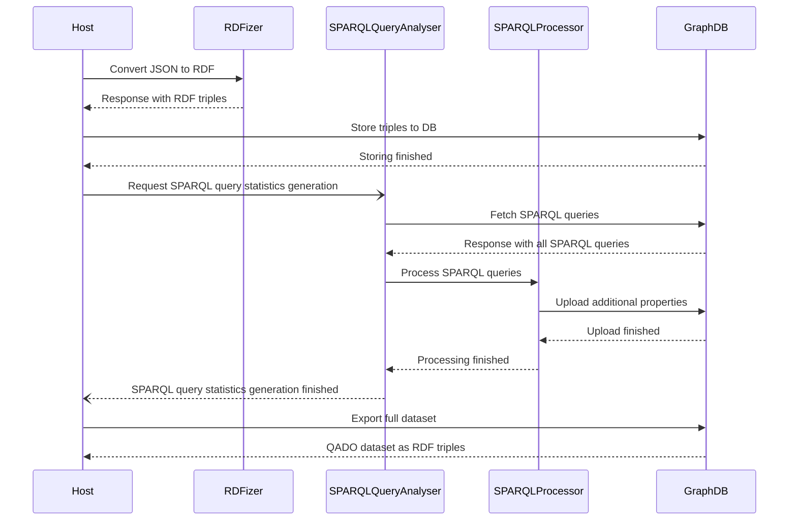

# QADO dataset deployer
This repository contains a setup script to install a stardog instance via Docker
with the QADO dataset. Therefor, the following services are used:
* [QADO Question Answering RDFizer](https://github.com/WSE-research/QADO-question-answering-dataset-RDFizer) (basic JSON benchmark to RDF mapping)
* [QADO SPARQL Query Analyser](https://github.com/WSE-research/SPARQLQueryAnalyser) (extending SPARQL query objects with statistics)
* [GraphDB](https://www.ontotext.com/products/graphdb/) (temporarly required for storing QADO data, accessible during build process at http://localhost:7200)



## Configure benchmarks
Inside the `datasets` directory all tested benchmarks, that can be
integrated into the QADO dataset, are provided. If you want to add
additional benchmarks, provided a valid [RDFizer payload](https://github.com/WSE-research/QADO-question-answering-dataset-RDFizer#api-endpoint)
as a new JSON file.

## Run deployer
1. Clone the repository
    ```shell
    git clone https://github.com/WSE-research/QADO-dataset-deployer.git
    ```
2. Run the deployment script
   ```shell
   bash deploy.sh 
   ```

The script generates a ZIP file `qado-benchmark.zip` containing the
full dataset (`full-qado.ttl`) and all supported benchmarks as
separated files in the `datasets` subdirectory.
